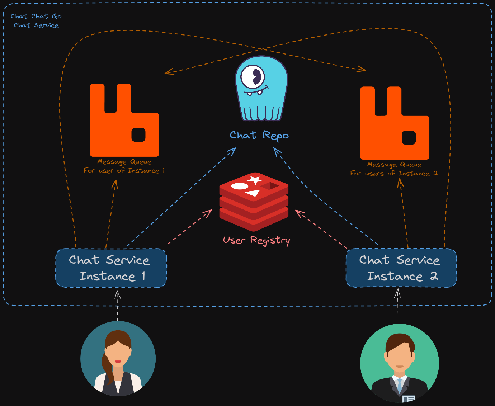

# Chat Chat Go - Chat Service

## Service Deisgn

- SycllaDB, storing messages data
- RabbitMQ queue per service instance recevicing messages needed to reach the connected users to it
- Redis store as a user registry, to answer the question: which queue to publish into so that user A can get the messages?

#### Todos

- [] Cleaner project
- [] Unit and Integration tests
- [] CI/CD
- [] Deployment with K8S
- [] Observability layer
